<div align="center">



# 🎮 2048 — Pygame Edition

**A beautifully styled, fully playable 2048 puzzle game built with Python & Pygame.**  
Merge tiles. Reach 2048. Beat the board.

[](https://soumyajyoti2005.github.io/2048/)
[](https://python.org)
[](https://pygame.org)
[](https://pygame-web.github.io)

</div>

---

## ✨ Features

- 🎨 **Custom pink/violet color theme** — unique tile colors for every value from 2 → 2048
- 🎮 **Keyboard controls** — arrow keys to move tiles
- 👆 **Swipe/touch support** — works on laptop touchpad and mobile screens
- 🌐 **Browser playable** — exported with Pygbag, runs in any browser
- 💀 **Real game-over logic** — only ends when board is full AND no merges are possible
- 🔄 **Restart anytime** — press `R` to reset the board
- ✨ **Smooth animations** — tiles slide and merge with fluid motion

---

## 🕹️ Play Now

> **[👉 Click here to play in your browser](https://soumyajyoti2005.github.io/2048/)**

No installation needed — just open and play!

---

## 📸 Tile Colors

| Value | Color |
|-------|-------|
| 2 | 🟣 Soft Muted Pink `#7a3060` |
| 4 | 🟣 Dusty Rose `#9a3870` |
| 8 | 🩷 Medium Pink `#b84282` |
| 16 | 🩷 Warm Pink `#cd5293` |
| 32 | 💗 Bright Pink `#e060a0` |
| 64 | ❤️ Hot Pink `#dc3c78` |
| 128 | 🔴 Deep Rose `#c82864` |
| 256 | 🔴 Rich Magenta `#b41450` |
| 512 | 🟤 Deep Magenta `#a00a3c` |
| 1024 | 🟤 Dark Crimson `#82052d` |
| 2048 | ✨ Bright White-Pink `#ffdcf0` |

---

## 🚀 Run Locally

### Requirements
```bash
pip install pygame
```

### Run
```bash
python main.py
```

---

## 🌐 Run in Browser (Pygbag)

```bash
pip install pygbag
pygbag 2048
```
Then open `http://localhost:8000`

---

## 🎯 How to Play

| Action | Control |
|--------|---------|
| Move tiles | `←` `→` `↑` `↓` arrow keys |
| Swipe | Touchpad / phone screen swipe |
| Restart | Press `R` |
| Quit | Close window |

**Goal:** Combine matching tiles to create the **2048** tile!

- Every move, a new `2` or `4` tile spawns randomly
- Tiles with the **same value** merge when they collide
- Game over when the board is **full** and **no merges** are possible

---

## 📁 Project Structure

```
2048/
├── main.py          # Main game file
├── index.html       # Pygbag web build entry
├── favicon.png      # Browser tab icon
├── banner.svg       # Animated README banner
└── build/
    └── web/         # Full web build output
```

---

## 🛠️ Built With

- **Python 3.13**
- **Pygame 2.6**
- **Pygbag** — for browser export
- **GitHub Pages** — for free hosting

---

<div align="center">

Made with ❤️ by [soumyajyoti2005](https://github.com/soumyajyoti2005)

⭐ Star this repo if you had fun playing!

</div>